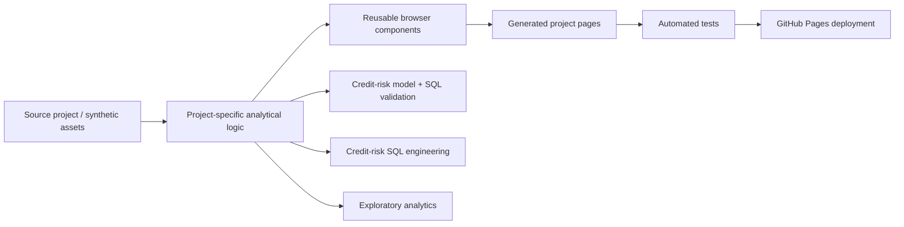

# Data Observatory

Interactive portfolio by Marwan Ahmed, focused on risk analytics, SQL/data engineering, model validation, financial analysis, and browser-based data storytelling.

## Reviewer path

For a fast technical review, follow the same risk-first order as the main portfolio:

1. open **[iScore Credit Lab](https://mrwanahmedx.github.io/data-observatory/credit-methodology.html)** — independent synthetic case study, one flagship project with its linked model dashboard,
2. inspect **[IFRS 9 / PD Modeling](./research/ifrs9-modeling/README.md)** — staging, PD/LGD/EAD and probability-weighted loss calculations,
3. inspect **[Model Validation](./research/model-validation/README.md)** — discrimination, calibration, PSI and observed-versus-expected testing,
4. inspect **[Credit Risk SQL](https://github.com/mrwanahmedx/Credit-Risk-Management-Database-SQL-Project)** — grain-safe engineering and reconciliation,
5. inspect **[EGX Quant Research](https://github.com/mrwanahmedx/EGX-Quant-Research)** — evidence-gated market research,
6. inspect **[HR Attrition](https://github.com/mrwanahmedx/HR-Attrition-Analysis-Using-Python)** — Python exploratory analysis.

The portfolio is intentionally explicit about limitations: synthetic or illustrative data is labeled, failed assumptions are documented, and reliability changes are preserved in Git history.

## Architecture



## Tech stack

- JavaScript / ES modules
- HTML / CSS
- Node.js build scripts
- Python + SQL source embedded for the Credit Lab
- GitHub Actions CI
- GitHub Pages

## What is in the site

- **iScore Credit Lab** — independent synthetic credit-risk analytics, calibration and stability, threshold analysis, and engineered SQL/Python, with a dedicated case study and dashboard.
- **IFRS 9 / PD Modeling** — clean-room synthetic ECL with configurable staging, PD/LGD/EAD, scenarios, discounting and regression tests.
- **Model Validation** — independent synthetic discrimination, calibration, PSI, observed-vs-expected backtesting and verdicts.
- **Credit Risk SQL** — SQL/database design and grain-control project.
- **EGX Quant Research** — evidence-gated quant research, maintained in its own repository.
- **HR Attrition** — Python exploratory analysis project.
- **Synthetic Risk Model Lab** — separate executable Python PD-development workflow with calibrated validation, held-out tests and PIT-style scenarios.
- **Suez Canal Bank financial dashboard** — illustrative bank financial analysis and interactive visualisation.
- Scroll-driven model/data-visualisation experiments on the homepage.

All Credit Lab data is synthetic. No employer data, customer records, internal bank models or confidential methods are used.

## Clean-room research modules

- [IFRS 9 Credit Risk Modeling](research/ifrs9-modeling/README.md)
- [Credit Risk Model Validation](research/model-validation/README.md)

GitHub CI currently executes **15 regression tests** across the two research modules: 7 for the ECL engine and 8 for the validation engine. The validation demo intentionally returns **PASS WITH LIMITATIONS** when calibration evidence breaches the illustrative governance ranges.

Both modules are governed by [PUBLIC_DATA_BOUNDARY.md](PUBLIC_DATA_BOUNDARY.md). They use synthetic/public concepts only and prohibit employer/customer data, internal schemas, proprietary methods and private model outputs.

## Risk Model Lab

The dedicated model-development project lives in [`risk-model-lab/`](./risk-model-lab/).

Key documentation:

- [Architecture](./risk-model-lab/docs/ARCHITECTURE.md)
- [Data dictionary](./risk-model-lab/docs/DATA_DICTIONARY.md)
- [TTC / PIT concept note](./risk-model-lab/docs/TTC_PIT_NOTE.md)
- [Model governance](./risk-model-lab/docs/MODEL_GOVERNANCE.md)
- [Architecture decision records](./risk-model-lab/docs/decisions/)
- [3.2.0 release notes](./docs/releases/3.2.0.md)

The model lab has its own Python CI in addition to the portfolio browser/unit-test pipelines.

## Development

Requires Node.js 20 or later. No package installation is required.

```sh
npm run build
npm test
node serve.mjs
```

Then open `http://127.0.0.1:4186`.

The source of truth is the repository source files. `build.mjs` creates the deployable site in `dist/`; generated HTML pages and packaged site archives are intentionally not committed.

## Deployment

Pull requests to `main` first run a non-deploying CI gate that builds the site, checks browser JavaScript syntax, and runs the automated test suite. GitHub Pages then rebuilds current source on merged pushes to `main` and deploys `dist/` only if those checks pass again.

The test suite covers:

- dashboard calculations and chart bounds,
- local links and generated assets,
- model metrics and threshold logic,
- Credit Lab SQL/source parity,
- synthetic-data controls,
- navigation and interaction state.

## Credit Lab architecture

Runtime Credit Lab assets live in `assets/credit-lab/`:

- `analytics.json` — synthetic borrower/model results used by the dashboard,
- `results.json` — reference outputs used for generated case-study pages and tests,
- `queries.json` — SQL reports with explicit grain control, duplicate guards and anti-fan-out joins,
- `sources.json` — Python source shown in the web code studio.

The portfolio is intentionally **web-first**: visitors inspect code and saved results in the browser rather than being pushed toward project-file downloads.

[Engineering change log](./CHANGELOG.md) · [Live Data Observatory](https://mrwanahmedx.github.io/data-observatory/) · [GitHub profile](https://github.com/mrwanahmedx) · [LinkedIn](https://www.linkedin.com/in/mrwan-ahmed/)
