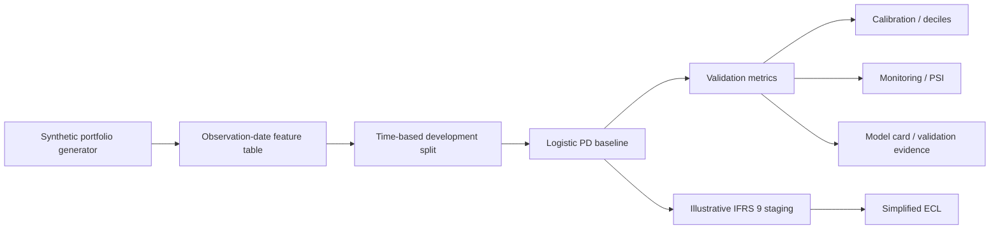

# Credit Risk Model Development Lab

Standalone-ready synthetic credit-risk modeling project focused on **PD model development, validation, monitoring, and illustrative IFRS 9-style staging/ECL mechanics**.

> **Important:** all data is synthetic. This project does not contain employer, bank, customer, or confidential model information. The IFRS 9 examples are educational and are not a regulatory implementation.

## What this project demonstrates

- explicit observation / outcome timing,
- synthetic borrower-level data generation,
- out-of-time development / validation split,
- transparent logistic-regression PD baseline,
- ROC AUC, Brier score, KS, calibration tables and deciles,
- population-stability monitoring,
- model-card and validation documentation,
- illustrative staging using DPD / PD deterioration,
- simplified ECL mechanics using PD, LGD and EAD,
- automated tests and reproducible CI.

## Architecture



## Modeling protocol

- **Target:** synthetic 12-month default indicator.
- **Development:** earlier observation cohorts.
- **Validation:** later observation cohorts; no random reshuffle across time.
- **Primary model:** logistic regression with standardized numeric inputs and one-hot categorical inputs.
- **Primary discrimination metric:** ROC AUC.
- **Probability quality:** Brier score plus calibration-by-decile.
- **Ranking diagnostic:** KS statistic.
- **Population monitoring:** PSI against development feature distributions.
- **Staging:** illustrative only; combines 30/90 DPD rules with a relative PD-deterioration trigger.
- **ECL:** simplified educational formula; not a complete IFRS 9 cash-flow engine.

## Quick start

Python 3.11+.

```bash
python -m pip install -e .[dev]
python -m credit_risk_model.pipeline
pytest -q
```

## Repository structure

```text
src/credit_risk_model/       model-development package
tests/                       reproducibility and validity controls
docs/                        model card, data dictionary, validation notes, ADRs
examples/                    minimal runnable example
.github/workflows/ci.yml     executable project validation
```

## Engineering controls

- target column is excluded from model features,
- time split is asserted in tests,
- generated probabilities must stay in [0, 1],
- staging precedence is tested,
- ECL must remain non-negative and bounded by EAD under the simplified assumptions,
- synthetic generation is deterministic by seed,
- validation metrics are computed only on the later cohort.

## Limitations

- synthetic data and synthetic default-generating process,
- simplified macro and borrower relationships,
- no TTC/PIT regulatory calibration claim,
- no real bank segmentation or rating scale,
- no survival / competing-risk modeling,
- simplified one-period ECL illustration rather than discounted contractual cash-flow modeling,
- no claim of production readiness or regulatory approval.

## Why this project exists

The objective is not to show a flashy model. It is to show the **discipline around a model**: timing, grain, baseline choice, validation, monitoring, documentation, and explicit boundaries on what the evidence supports.
