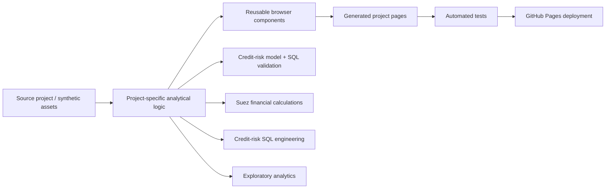

# Data Observatory

Interactive portfolio by Marwan Ahmed, focused on risk analytics, SQL/data engineering, model validation, financial analysis, and browser-based data storytelling.

## Reviewer path

For a fast technical review:

1. open the [live Data Observatory](https://mrwanahmedx.github.io/data-observatory/),
2. inspect **Credit Risk Lab** for Python, SQL, model validation, and governance,
3. inspect **Credit Risk Management** for grain-safe SQL/data engineering,
4. inspect **Suez Canal Bank** for financial-analysis/dashboard work,
5. read the [engineering change log](./CHANGELOG.md) for material fixes and regression controls.

The portfolio is intentionally explicit about limitations: synthetic or illustrative data is labeled, failed assumptions are documented, and reliability changes are preserved in Git history.

## Architecture



## Tech stack

- JavaScript / ES modules
- HTML / CSS
- Node.js build scripts
- Python + SQL source embedded for the Credit Lab
- GitHub Actions CI
- GitHub Pages

## What is in the site

- **Suez Canal Bank dashboard** — an interactive web recreation of the original Power BI project, with coherent selected-year KPI logic and bounded chart rendering.
- **Credit Risk Lab** — synthetic credit-risk analytics with model performance, calibration, stability, threshold analysis, engineered SQL and Python source shown directly in the browser.
- **Credit Risk Management** — SQL/database design project.
- **Understanding Attrition** — Python exploratory analysis project.
- Scroll-driven model and data-visualisation experiments on the home page.

All Credit Lab data is synthetic. No employer data, customer records, internal bank models or confidential methods are used.

## Development

Requires Node.js 20 or later. No package installation is required.

```sh
npm run build
npm test
node serve.mjs
```

Then open `http://127.0.0.1:4186`.

The source of truth is the repository source files. `build.mjs` creates the deployable site in `dist/`; generated HTML pages and packaged site archives are intentionally not committed.

## Deployment

Pull requests to `main` first run a non-deploying CI gate that builds the site, checks browser JavaScript syntax, and runs the automated test suite. GitHub Pages then rebuilds current source on merged pushes to `main` and deploys `dist/` only if those checks pass again.

The test suite covers:

- dashboard calculations and chart bounds,
- local links and generated assets,
- model metrics and threshold logic,
- Credit Lab SQL/source parity,
- synthetic-data controls,
- navigation and interaction state.

## Credit Lab architecture

Runtime Credit Lab assets live in `assets/credit-lab/`:

- `analytics.json` — synthetic borrower/model results used by the dashboard,
- `results.json` — reference outputs used for generated case-study pages and tests,
- `queries.json` — SQL reports with explicit grain control, duplicate guards and anti-fan-out joins,
- `sources.json` — Python source shown in the web code studio.

The portfolio is intentionally **web-first**: visitors inspect code and saved results in the browser rather than being pushed toward project-file downloads.

[Engineering change log](./CHANGELOG.md) · [Live Data Observatory](https://mrwanahmedx.github.io/data-observatory/) · [GitHub profile](https://github.com/mrwanahmedx) · [LinkedIn](https://www.linkedin.com/in/mrwan-ahmed/)
