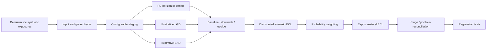

# Architecture

## Contracts

- one final row per `exposure_id`,
- no negative risk inputs or ECL,
- Stage 3 overrides Stage 2,
- scenario weights must sum to one,
- scenario calculations remain visible and separately testable,
- synthetic inputs are reproducible from a fixed seed.

## Separation from production systems

The module has no connection to a bank database, impairment engine, reporting platform, or internal policy library. It is intentionally self-contained.
