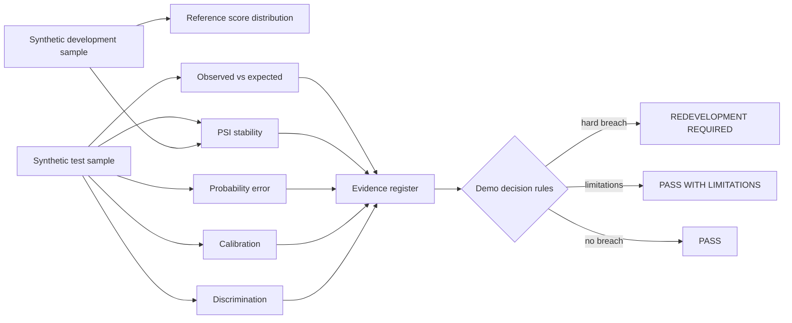

# Architecture

## Validation principle

A single metric never decides model quality. Ranking, calibration, stability, probability error, event sufficiency and outcome backtesting are recorded separately before a visible decision rule is applied.

## Independence boundary

The validation module consumes predictions/outcomes as evidence. It does not train the model being validated or alter predictions to obtain a preferred verdict.
