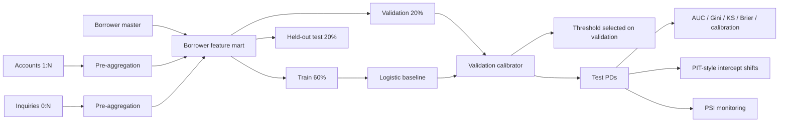

# Synthetic Credit Risk Model Lab

A self-contained model-development and validation project for **synthetic probability-of-default research**.

The project is designed to show the full reasoning chain that matters in credit-risk model work:

```text
raw one-to-many credit data
        ↓
grain control / aggregation
        ↓
borrower feature mart
        ↓
train / validation / held-out test
        ↓
transparent logistic baseline
        ↓
validation-only calibration + threshold selection
        ↓
held-out discrimination / calibration metrics
        ↓
PIT-style scenario shift
        ↓
monitoring + governance evidence
```

> **Boundary:** this is a portfolio model-development lab, not a bank model, not an IFRS 9 implementation, and not a regulatory calibration framework. All data is synthetic.

## Why this project exists

Dashboard projects show interpretation. This project focuses on the model-development layer behind risk analytics:

- one-to-many source grain,
- deterministic feature construction,
- leakage-safe split discipline,
- transparent baseline modeling,
- calibration,
- test-sample protection,
- monitoring metrics,
- scenario-conditioned PD movement,
- documented model limitations and governance gates.

## Architecture



## Data grain

| Table | Grain | Purpose |
| --- | --- | --- |
| borrowers | one row / borrower | static borrower attributes |
| accounts | one-to-many borrower → account | exposure, limit, DPD, repayment, collateral |
| inquiries | zero-to-many borrower → inquiry | recent credit-seeking activity |
| outcomes | one row / borrower | future synthetic 12-month default |
| feature mart | one row / borrower | model-development input |

The feature builder aggregates child tables **before** joining them to borrower grain and asserts final borrower uniqueness.

## Model-development protocol

1. Generate reproducible synthetic raw tables.
2. Aggregate account and inquiry sources to borrower grain.
3. Join only after each one-to-many source is reduced.
4. Split borrowers into train / validation / test.
5. Fit preprocessing and logistic regression on **training only**.
6. Fit probability calibration on **validation only**.
7. Select a demonstration operating threshold on **validation only**.
8. Touch the held-out test sample only after model and threshold choices are fixed.
9. Report discrimination, calibration and stability diagnostics.
10. Apply transparent log-odds scenario shifts as a PIT-style teaching mechanism.

## Metrics

The test report includes:

- ROC AUC,
- Gini,
- KS,
- Brier score,
- calibration intercept,
- calibration slope,
- mean predicted PD,
- observed default rate,
- train-vs-test score PSI,
- validation-selected threshold.

## TTC / PIT concept

The repository deliberately avoids pretending that one formula constitutes regulatory PIT calibration.

The implemented scenario mechanism applies a **common log-odds intercept shift** to a base PD vector so the portfolio mean reaches a stated target while preserving borrower rank ordering.

See [TTC / PIT note](docs/TTC_PIT_NOTE.md).

## Quick start

```bash
cd risk-model-lab
python -m pip install -e .
python -m unittest discover -s tests -v
python -m risk_model_lab.pipeline --borrowers 5000 --output artifacts/run.json
```

## Repository structure

```text
src/risk_model_lab/
  data.py       synthetic relational data + grain-controlled feature mart
  model.py      preprocessing, logistic baseline, calibration, threshold
  metrics.py    AUC / Gini / KS / Brier / calibration / PSI
  pit.py        transparent portfolio log-odds shift
  pipeline.py   reproducible development workflow

tests/          model-development controls
docs/           data dictionary, PIT note, governance
```

## Governance stance

The project is intentionally fail-closed:

- duplicate borrower grain → error,
- invalid PIT target → error,
- no production claim from synthetic metrics,
- test sample is not used for calibration or threshold selection,
- limitations are emitted in every pipeline result.

See [Model Governance](docs/MODEL_GOVERNANCE.md).

## Limitations

- synthetic data,
- random borrower-disjoint split rather than out-of-time validation,
- logistic baseline only,
- synthetic outcome process partly favors monotonic logistic structure,
- simplified calibration and PIT illustration,
- no EAD/LGD/ECL engine,
- no claim of IFRS 9, Basel, CBE, bureau, or bank-model compliance.

## Author

Marwan Ahmed · Risk analytics / model-development portfolio
